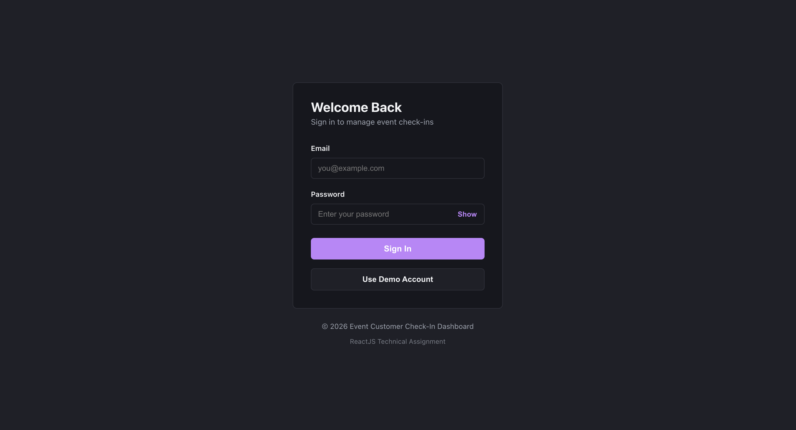
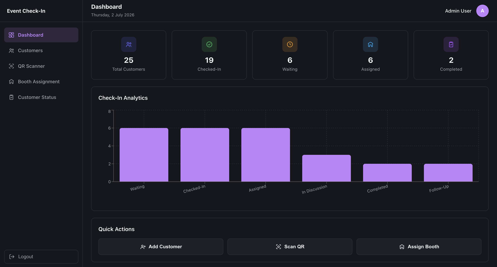
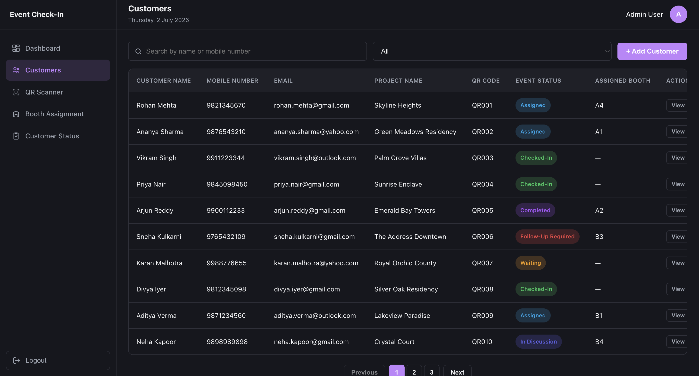
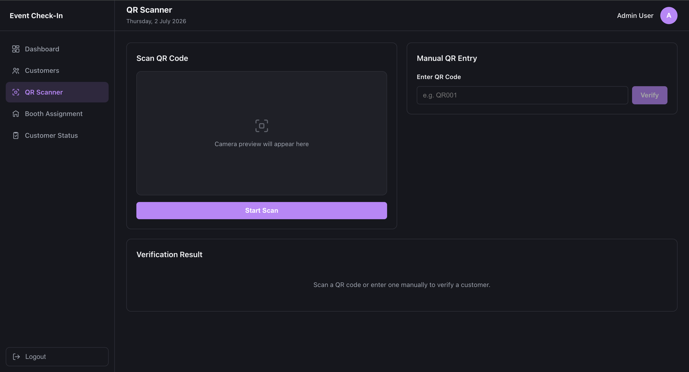
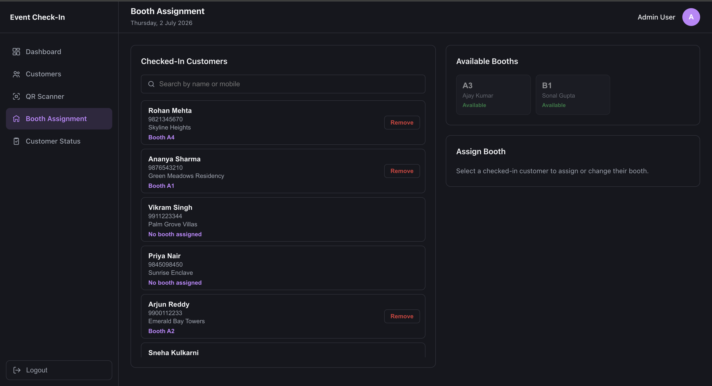
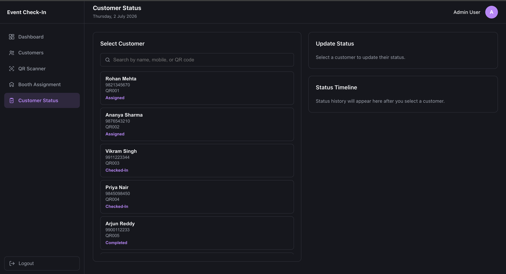

# Event Customer Check-In Dashboard

A modern React-based Event Customer Check-In Dashboard for managing customer registrations, QR-based check-ins, booth assignments, and event status tracking through an intuitive admin interface.

## Overview

The app lets an event admin log in and:

- Track every registered customer and their current event status.
- Scan (camera) or manually enter a customer's QR code to verify identity and check them in.
- Assign, change, or remove a booth for checked-in customers.
- Update a customer's status through the event lifecycle, with a full audit history.
- View live dashboard statistics (totals, check-ins, status breakdown) driven entirely by the mock API — no hardcoded numbers.

A [json-server](https://github.com/typicode/json-server) instance backed by `db.json` stands in for a real backend.

## Features

- **Authentication** — email/password login, session persisted in `localStorage`, protected routes, auto-redirect for already-authenticated users.
- **Dashboard** — summary cards, check-in analytics chart, and quick actions, all computed from live customer data.
- **Customer Management** — list, search, filter by status, paginate, add, edit, view details, and delete customers.
- **QR Scanner** — live camera scanning (`html5-qrcode`) with a manual entry fallback, customer verification, and one-click check-in.
- **Booth Assignment** — assign/change/remove a booth for any checked-in customer, with duplicate-assignment and availability checks.
- **Customer Status** — update status (Waiting → Checked-In → Assigned → In Discussion → Completed / Follow-Up Required) with remarks and an optional follow-up date, plus a full status timeline per customer.
- **UX details** — loading, empty, and error states with retry across every data view; toast notifications for every mutation.
- **Responsive UI** — Optimized for desktop and tablet devices with a clean, consistent user experience across different screen sizes.

## Tech Stack

| Layer              | Choice                                           |
| ------------------ | ------------------------------------------------ |
| UI                 | React 19 (functional components + hooks)         |
| Build tool         | Vite                                             |
| Routing            | React Router v7                                  |
| Forms & validation | React Hook Form                                  |
| HTTP client        | Axios                                            |
| Notifications      | React Toastify                                   |
| Charts             | Recharts                                         |
| QR scanning        | html5-qrcode                                     |
| Mock backend       | json-server                                      |
| Linting            | ESLint (flat config) + eslint-plugin-react-hooks |

## Folder Structure

```
src/
├── api/                  # Axios instance (base URL, interceptors)
├── components/           # Reusable, presentational components
│   ├── customer/         # Search bar, filters, table, modals, loading/empty/error states, timeline
│   ├── icons/             # Shared inline SVG icon components
│   ├── qr/                # Camera scanner, manual entry, verification card
│   ├── Card/, Header/, Sidebar/, SummaryCard/
├── constants/             # Routes, config, status enums
├── context/               # AuthContext + AuthProvider
├── hooks/                 # Shared hooks (useAuth, useEscapeKey)
├── layouts/                # AuthLayout, MainLayout (sidebar + header shell)
├── pages/                  # One folder per route (Login, Dashboard, Customers, QRScanner, BoothAssignment, CustomerStatus, NotFound)
├── routes/                  # AppRoutes, ProtectedRoute
├── services/                 # Thin API wrappers — the only files that call Axios
└── utils/                     # Small shared helpers (status badge class lookup)
```

Path aliases (`@`, `@api`, `@components`, `@constants`, `@context`, `@hooks`, `@layouts`, `@pages`, `@routes`, `@services`, `@utils`) are configured in `vite.config.js` and `jsconfig.json`.

## Installation

```bash
npm install
```

A `.env` file already exists at the project root pointing at the mock API:

```
VITE_API_BASE_URL=http://localhost:5000
```

## Running the React Application

```bash
npm run dev
```

The app runs at `http://localhost:5173` by default.

## Running the JSON Server (mock backend)

In a separate terminal:

```bash
npm run mock-server
```

This serves `db.json` at `http://localhost:5000` (`--watch` reloads on file changes). **Both the React app and the mock server need to be running** for the app to work.

## Demo Login Credentials

| Field    | Value               |
| -------- | ------------------- |
| Email    | `admin@example.com` |
| Password | `Admin@123`         |

The Login page also has a **"Use Demo Account"** button that fills these in for you — you still need to click **Sign In** to log in.

## API Endpoints

All requests go to `VITE_API_BASE_URL` (json-server), routed through `src/api/axiosClient.js`.

| Method | Endpoint                 | Used for                                                |
| ------ | ------------------------ | ------------------------------------------------------- |
| GET    | `/users?email=`          | Login lookup                                            |
| GET    | `/customers`             | List customers                                          |
| POST   | `/customers`             | Add customer                                            |
| PUT    | `/customers/:id`         | Edit customer / check-in / status / booth updates       |
| DELETE | `/customers/:id`         | Delete customer                                         |
| GET    | `/boothAssignments`      | List booths                                             |
| PUT    | `/boothAssignments/:id`  | Occupy / free a booth                                   |
| GET    | `/customerStatusHistory` | Full status history (filtered client-side per customer) |
| POST   | `/customerStatusHistory` | Append a new status/check-in/booth event                |

## Third-Party Libraries Used

- `react-router-dom` — client-side routing
- `react-hook-form` — form state and validation
- `axios` — HTTP client
- `react-toastify` — toast notifications
- `recharts` — dashboard chart
- `html5-qrcode` — camera-based QR scanning
- `json-server` — mock REST API for local development

## Project Flow

1. **Login** with the demo credentials (or use the "Use Demo Account" button) → redirected to the Dashboard.
2. **Dashboard** shows live totals and a status breakdown chart, pulled from `/customers` on every visit.
3. **Customers** page: add a new customer (auto-generated sequential QR code), search/filter/paginate, edit, view, or delete.
4. **QR Scanner**: scan a customer's QR code (camera or manual entry) → verify their details → **Check-In** (marks `checkedIn: true`, status → `Checked-In`, logs a status-history event).
5. **Booth Assignment**: pick a checked-in customer, assign an available booth (status → `Assigned`), change it later, or remove it (booth freed, status reverts to `Checked-In`).
6. **Customer Status**: pick any customer, set a new status + remarks (+ follow-up date if the status is `Follow-Up Required`) → appended to that customer's timeline.
7. **Logout** clears the stored session and redirects to Login.

## Screenshots

### Login



### Dashboard



### Customers



### QR Scanner



### Booth Assignment



### Customer Status



## Assumptions Made

- Authentication is a mock flow against json-server (plaintext password match, fake JWT string) — acceptable for a front-end assignment, not production-grade auth.
- A customer's `checkedIn` flag is treated as a one-way flag: once true it stays true, even if their status is later changed away from `Checked-In` (e.g. to `Assigned` or `Completed`).
- Booth numbers are unique and fixed (seeded in `db.json`); the app does not support creating new booths.
- QR codes are unique strings matched case-insensitively against `customer.qrCode`.

## Known Limitations

- No automated tests (unit/integration/e2e) are included.
- No pagination/virtualization on the Booth Assignment or Customer Status customer lists — they rely on a capped-height scroll container, fine for the seeded dataset size but not built for thousands of records.
- Dashboard "Check-In Analytics" only charts the six event-status buckets; it doesn't offer date-range filtering.
- No dark/light mode toggle — the UI follows the OS `prefers-color-scheme` only.
- The mock backend has no real persistence beyond the local `db.json` file and no concurrent-write protection.

## Future Improvements

- Add unit tests (Vitest + React Testing Library) for services and key components.
- Add a real backend with proper authentication (hashed passwords, real JWTs, refresh tokens).
- Virtualize long lists and add server-side pagination once data volume grows.
- Add role-based access control (the `role` field already exists on the user record but isn't used yet).
- Code-split routes to reduce the initial JS bundle size.
